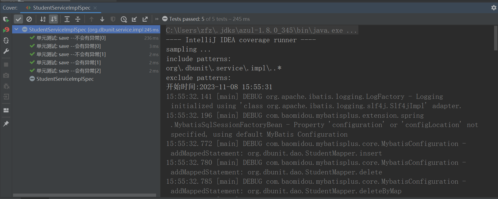
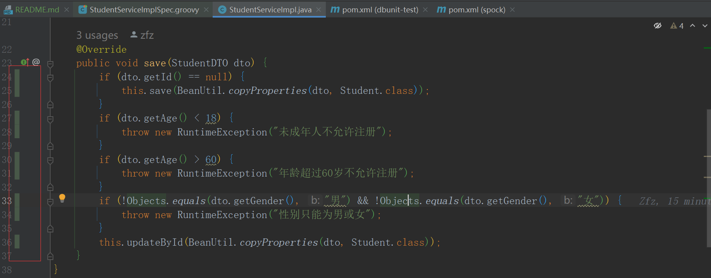

>
参考: [Spock单元测试框架介绍以及在美团优选的实践 - 美团技术团队](https://tech.meituan.com/2021/08/06/spock-practice-in-meituan.html)

背景：在找有关于单元测试文章的时候，看到美团技术写的一篇文章。读了好几遍确认是非常好的方案，可惜文章中并未直接给出具体源码，于是花了一两周通过相关线索在网上查找收集

框架：myabtisPlus+springboot+mysql+h2+redis mysql、h2 二选一使用，默认使用h2进行单元测试

### 简单教程

拉取项目后 直接运行 org/dbunit/service/impl/StudentServiceImplSpec.groovy 文件

### 运行效果

